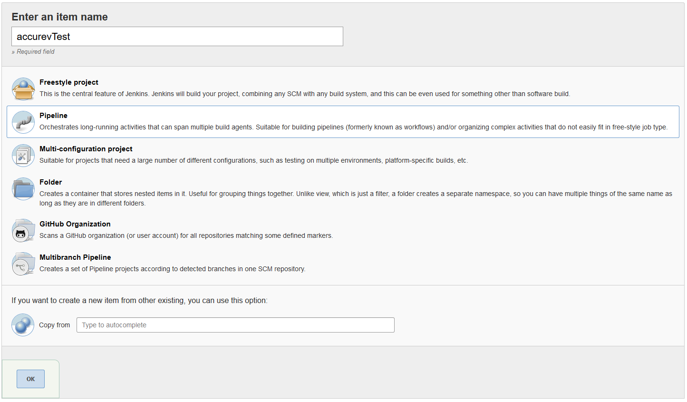
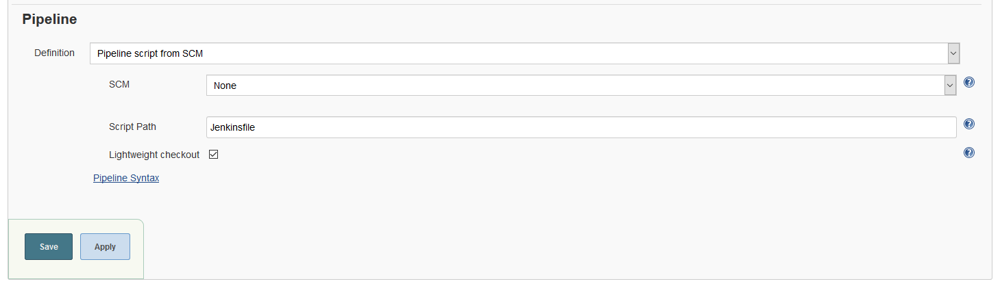
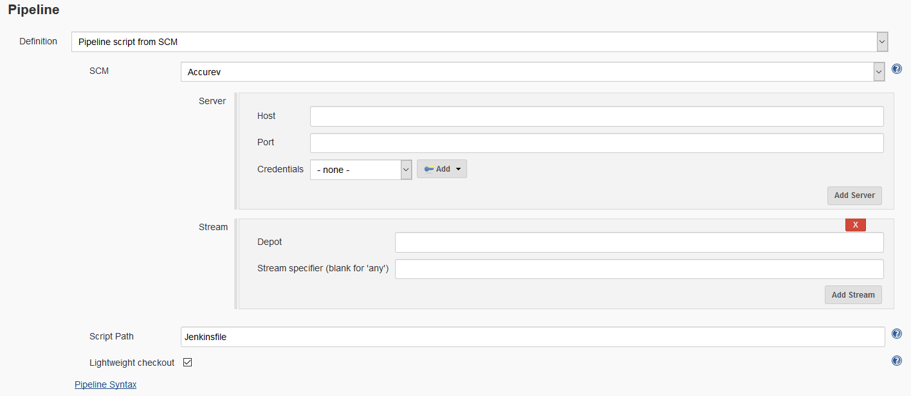
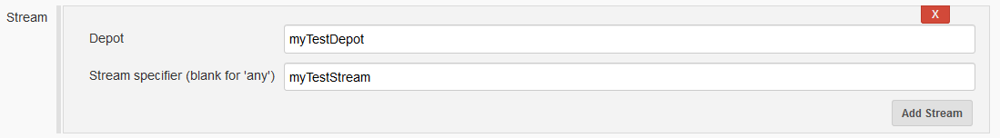
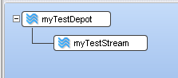
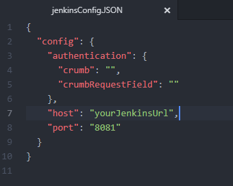

# Accurev SCM plugin guide

This guide covers how to create a pipeline using Acccurev as the primary SCM.

First press new item

Insert the name of your pipeline and choose Pipeline. Press OK.

You have now created the template for the pipeline. Scroll down to the section "Pipeline". Click on the Definition and choose "Pipeline Script from SCM".

In the "SCM" dropdown menu, choose "Accurev".

Fill the Host with the host address for your Accurev server and the Port with the port number for your Accurev Server (by default 5050), and add the credentials for the user you want to check out with from Accurev.

In the Stream section you specify the streams you want to be able to check for. As an example, say you have a depot named "myTestDepot", and a child stream called "myTestStream". If you wish to build "myTestStream", then you should fill the boxes as:

When you have a layout like this:

Remember to specify the path to the Jenkinsfile. As default it resides in the root directory.
The lightweight checkout is per default checked, as this results in the master only having to check out the Jenkinsfile, opposed to checking out the whole directory on master, and then again on the slave.

The project can now build the Accurev Stream when you click the "Build Now".

If you wish to add a webhook to it, such that it builds automatically when you promote to the stream, you need to add enable the server-post-promote-trig trigger to the depot. For this see section "Add post_promote_trigger to depot"

Click Save. You are now done.

## Add post_promote_trigger to depot

Copy the server_post_promote_hook and the jenkinsConfig.JSON files into accurev/storage/site_slice/triggers.

Open the jenkinsConfig.JSON file and fill out the URL for your Jenkins server in the Host & Port fields.

Open your prefered commandline tool in the triggers folder and write:

accurev mktrig server-post-promote-trig server_post_promote_hook -p myTestDepot

The post_promote_hook is now enabled for your depot.

